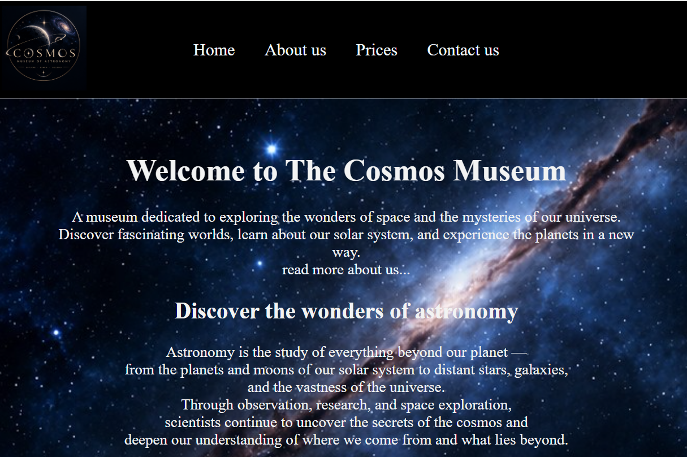
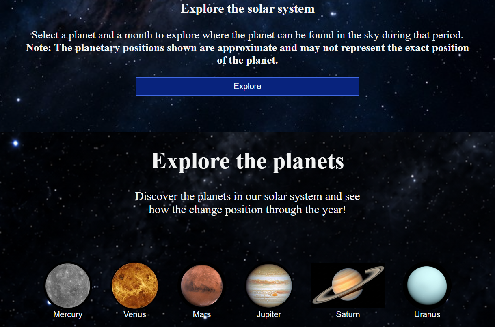
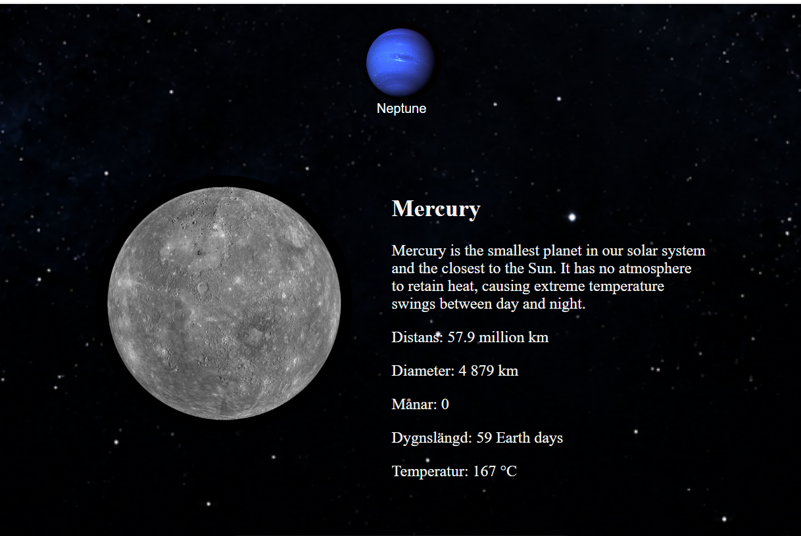
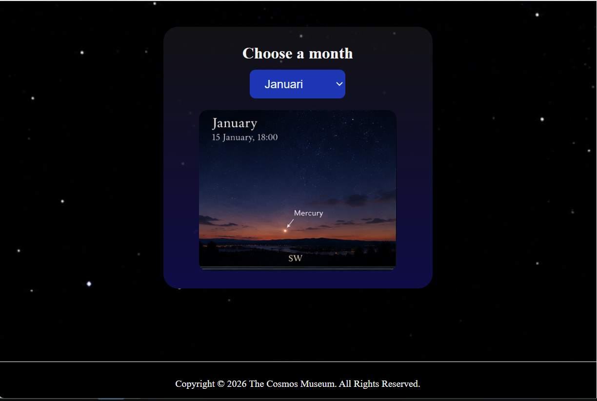

#  🪐 The Cosmos Museum Project

This is a project made as an end of course group project for the course [Webbutveckling, nivå 2](https://www.jensenkomvux.se/amnen/webbutveckling-niva-2) at [JENSEN komvux, Stockholm, Sweden](https://www.jensenkomvux.se/).

It is a minimal interactive responsive front-end website that uses HTML, CSS, and JavaScript. It presents information about a planet museum.

## 🏠 Homepage screenshots






## ✨ Features
* Responsive layout for desktop and mobile devices.
* Dynamic interactive elements exploring planet data.
* Clean, semantic structure.

## 🛠️ Built With
* **HTML5** 
* **CSS3** 
* **JavaScript** 

## 💻 How to Run Locally
No installation required! Just follow these steps:

1. Clone this repository:
   ```bash
   git clone https://github.com/MarianaB-dev/the-cosmos-museum.git
   ```
2. Navigate into the project folder.
3. Double-click the `index.html` file to open it in your browser.

## 💻 Co-authors
- Melina Panahi, https://github.com/melinapanahi
- Mariana Baryliuk, https://github.com/MarianaB-dev